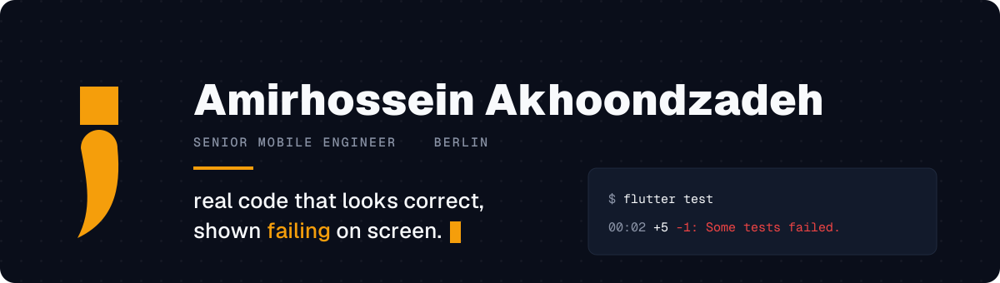

  
  
  

  

## The channel

essential semicolon is for working mobile engineers who have to decide
whether code is safe to ship. Each video takes real code that looks
correct, shows it failing on screen, proves the mechanism behind the
failure, and ends on a verdict.

No tutorials on things that already work. The interesting part is always
the gap between code that passes review and code that survives contact
with a real device.

## What is in here

**[weather_app_flutter](https://github.com/amirhosseinakhoondzadeh/weather_app_flutter)**
is the one to read first. Clean Architecture split across data, domain and
presentation, Bloc for state, get_it for injection, and 13 tests over the
bloc, the local datasource and both use cases. It reads from OpenWeatherMap
and handles nested vertical and horizontal scrolling, which is the part
that usually breaks.

**[energy_monitor_app_flutter](https://github.com/amirhosseinakhoondzadeh/energy_monitor_app_flutter)**
is the same architecture pointed at a local JSON API. fl_chart draws the
solar, house and battery series, and the watts to kilowatts switch
re-renders from data already fetched rather than calling the API again.
29 tests, including a widget test over the whole page.

**[mason_flutter_meetup_berlin_23](https://github.com/amirhosseinakhoondzadeh/mason_flutter_meetup_berlin_23)**
is the sample project from a talk I gave at a Flutter meetup in Berlin in
April 2023. It carries `meetup_brick`, a Mason brick that generates a full
Clean Architecture feature folder from two prompts.

**[flutter_design_patterns](https://github.com/amirhosseinakhoondzadeh/flutter_design_patterns)**
is the decorator pattern in Dart, written as a menu where each topping
wraps the item under it.
